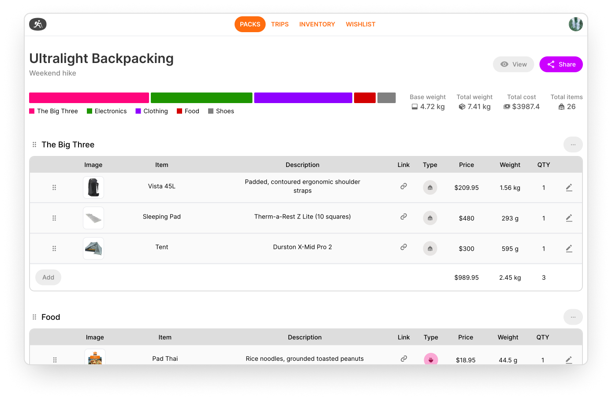

# Holos

Holos helps you plan your hikes with confidence. Organize your gear essentials and build the perfect pack for every trek.

Currently under development.

## Getting Started

### Next.js

1. Clone the repository
2. Install NPM packages in the project directory by running `npm install`
3. Run `npm run dev` and open [http://localhost:3000](http://localhost:3000) to view it in the browser.

### Storybook

To view stories, run `npm run storybook`

### Database

Holos uses Supabase. For local development, you'll need to install Docker and Supabase CLI ([more info here](https://supabase.com/docs/guides/cli/local-development)).

1. Make sure Docker is running. Navigate to the repository and initialize Supabase by running `supabase init`
2. To start, run `npm run startDB`
3. Run `resetDB` to reset and setup database using current migrations
4. Generate database types by running `npm run genTypes`
5. Stop all services (without resetting your local database) by running `npm run stopDB`
